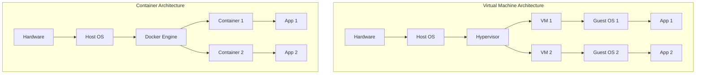
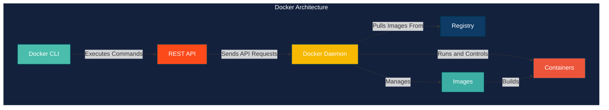
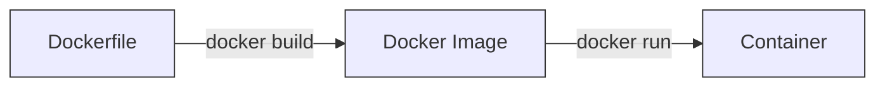
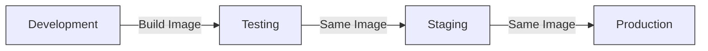
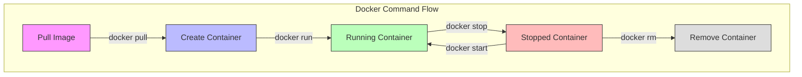
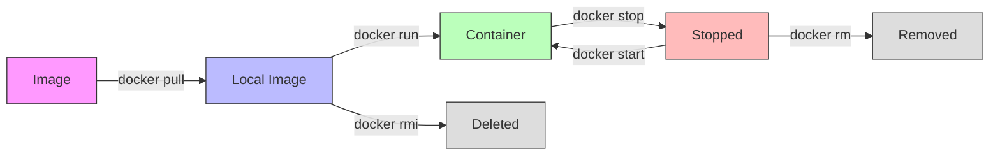
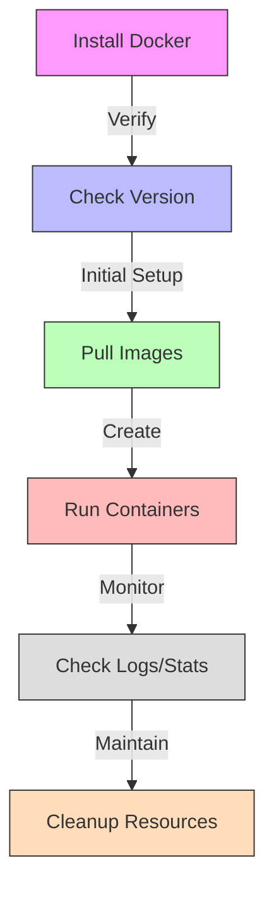

# Introduction to Docker

## The Problem Statement

How do you allow multiple applications to run on one machine at the same time?

Traditional challenges when using Virtual Machines:

1. **Efficient Resource Utilization**: Virtual Machines are resource-heavy
2. **Application Isolation and Security**: VM hosts file-system crashing into each other
3. **Scalability**: Virtual machines have inefficient resource management

### Comparison: VMs vs Containers



## Enters Containers

Containers offer a solution to these challenges by:
- Sharing the host operating system's (OS) kernel
- Being lightweight with minimal overhead
- Providing fast startup times
- Enabling efficient resource utilization

## What is Docker?

Docker is the platform that enables the creation, management, and execution of containers. While containers handle the isolation, packaging, and consistent environment, Docker provides the tools and infrastructure that make working with containers easy and efficient.

### Docker as a Platform provides:
1. Docker Runtime
2. Image creation and management
3. Networking
4. Security
5. Volume and Storage Management

## How Docker Works



The Docker architecture consists of several key components:

1. **Docker Client**: Communicates with Docker daemon
2. **Docker Daemon (dockerd)**:
    - Listens for Docker API requests
    - Manages Docker objects (images, containers, networks, volumes)
3. **Communication**:
    - Uses REST API
    - Can communicate over UNIX sockets or network interface
    - Client and daemon can run on same or different systems

## Dockerfile and Image Creation

### Dockerfile
A Dockerfile serves as the recipe for building a Docker image. It contains instructions that specify:
- Base image to use
- Environment variables
- Dependencies to install
- Commands to execute



### Docker Image
The image building process:
1. Uses `docker build` command
2. Reads Dockerfile instructions sequentially
3. Executes instructions layer by layer
4. Caches layers for subsequent builds
5. Pulls necessary base image layers from registry (e.g., Docker Hub)
6. Generates unique identifier (digest) for the final image

## Docker Image vs Containers

Key differences:
- **Images**: Static, immutable blueprints
- **Containers**: Dynamic, running instances
    - Can be started, stopped, and destroyed
    - Provide isolated environments

## Development Workflow with Docker



## Benefits of Docker

1. **Efficient Resource Utilization**
    - Lightweight containerization
    - Optimized resource sharing
    - Better performance compared to VMs

2. **Application Isolation & Security**
    - Containerized applications run in isolation
    - Reduced risk of conflicts
    - Secure process and file system isolation

3. **Scalability**
    - Easy to scale containers up or down
    - Efficient resource management
    - Quick deployment and termination

4. **Portability**
    - Run consistently across any environment
    - "Build once, run anywhere" capability
    - Eliminates environment-specific issues

5. **Consistency**
    - Same environment from development to production
    - Eliminates "works on my machine" problems
    - Reproducible builds and deployments

Docker allows you to ship, test, and deploy your applications in any environment without worrying about incompatibility issues, regardless of the machine's configuration settings.

## Summary of Docker's Solution to Initial Problems

Docker addresses the original challenges by:
1. **Resource Efficiency**: Lightweight containers instead of heavy VMs
2. **Isolation**: Secure container boundaries without filesystem conflicts
3. **Scalability**: Efficient resource management and quick scaling
4. **Consistency**: Same environment across all stages of development and deployment
5. **Portability**: Run anywhere Docker is installed without modification

This comprehensive platform has revolutionized how we develop, deploy, and run applications in modern software development environments.

# Docker Commands Guide

## Installation

### Getting Started with Docker

1. Download Docker Desktop based on your OS:
   - Windows
   - macOS
   - Linux

2. Verify installation:
```bash
$ docker --version
```

## Essential Docker Commands



### Basic Commands Overview

1. **Running Containers**
   ```bash
   # Run a container in detached mode with port mapping
   docker run -d -p 8080:80 nginx
   ```
   - `-d`: Run in detached mode (background)
   - `-p 8080:80`: Map port 8080 on host to port 80 in container
   - `nginx`: Image name

2. **Container Management**
   ```bash
   # List all containers (running and stopped)
   docker ps -a
   
   # Stop a running container
   docker stop <container_id>
   
   # Start a stopped container
   docker start <container_id>
   
   # Remove a container
   docker rm <container_id>
   ```

3. **Image Management**
   ```bash
   # List all images
   docker images
   
   # Remove an image
   docker rmi <image_name>
   
   # Pull an image from registry
   docker pull <image-name>:<tag>
   ```

4. **Maintenance Commands**
   ```bash
   # Remove all stopped containers
   docker container prune
   
   # View container logs
   docker logs <container-id>
   
   # Inspect container details
   docker inspect <container-id>
   
   # View container resource usage
   docker stats
   ```

### Command Flow Visualization



## Common Command Patterns

### Container Lifecycle
1. **Creating and Running**
   ```bash
   # Pull image (optional, done automatically by run)
   docker pull nginx
   
   # Create and start container
   docker run -d nginx
   ```

2. **Monitoring**
   ```bash
   # View running containers
   docker ps
   
   # View logs
   docker logs <container-id>
   
   # View resource usage
   docker stats
   ```

3. **Stopping and Cleaning**
   ```bash
   # Stop container
   docker stop <container-id>
   
   # Remove container
   docker rm <container-id>
   
   # Remove image
   docker rmi nginx
   ```

### Important Notes:
- `docker run` creates a new container each time
- `docker start` restarts an existing container
- Use `docker ps -a` to see all containers, including stopped ones
- Always clean up unused containers with `docker container prune` to free up resources
- Use `docker inspect` to troubleshoot container issues
- Tags are important when pulling images (e.g., `nginx:latest`)

## Best Practices



1. **Resource Management**
   - Regularly run `docker container prune` to remove unused containers
   - Monitor container resources with `docker stats`
   - Remove unused images to free up disk space

2. **Debugging**
   - Use `docker logs` for troubleshooting
   - `docker inspect` provides detailed container information
   - Monitor container health with `docker stats`

3. **Security**
   - Always use specific image tags instead of `latest`
   - Regularly update images for security patches
   - Remove unnecessary containers and images